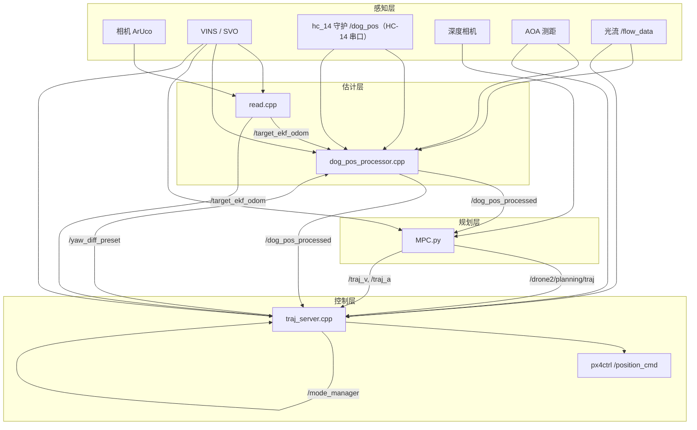

# Fast-Drone-250 无人机–机械狗协同控制系统架构总结

本文档基于以下核心文件梳理系统所用方法、数据流与模块协作关系：

| 模块 | 路径 | 角色 |
|------|------|------|
| 视觉目标估计 | `src/read/src/read.cpp` | ArUco 位姿 + VINS 融合，发布目标里程计 |
| 串口守护 | `hc_14/hc_14.cpp`（运行二进制 `HC_141/build/hc_14`） | HC-14 无线串口收发：发布 `/dog_pos`、转发背板信号 |
| 狗位姿处理 | `src/planning/src/dog_pos_processor.cpp` | 狗通信坐标与世界系对齐、滤波 |
| 轨迹规划 | `MPC.py` | 模型预测控制 + 深度避障，发布参考轨迹 |
| 轨迹跟踪与模式管理 | `src/planning/src/traj_server.cpp` | PID 跟踪、模式切换、下发飞控指令 |

---

## 1. 系统总体目标

实现**四旋翼无人机对移动机械狗（或降落板）的跟踪与降落**：

1. **远距离 / 避障阶段**：MPC 规划平滑轨迹，跟踪狗的世界系位姿。
2. **近距离精确阶段**：切换到狗体坐标系 PID，高精度跟随狗的速度与姿态。
3. **降落阶段**：控制高度下降，结合光流检测触发自锁降落。

各模块通过 ROS 话题串联，`/mode_manager`（`PoseStamped.pose.orientation.w`）作为全局模式开关。

---

## 2. 运行模式（`triger_mode`）

`traj_server` 与 `MPC.py` 通过 `/mode_manager` 协调工作。`orientation.w` 取值含义如下：

| `w` 值 | 名称 | MPC.py `triger` | traj_server 行为 |
|--------|------|-----------------|------------------|
| `-1` | 待机 | 0（关闭） | 不发布控制指令 |
| `0` | MPC 跟踪狗 | 1（`/dog_pos_processed`） | 跟踪 MPC 轨迹 + 世界系 PID |
| `-2` | Agent / command_pos | 2（`/command_pos`） | 同 MPC 模式，目标来自 agent |
| `1` | 精确跟随 | 0 | 狗体坐标系 PID，跟随狗速度 |
| `2` | 降落 | 0 | 体坐标系 PID + 下降 + 光流触发自锁 |

### 自动模式切换（`traj_server` 内 `flag_and_hc14_process_callback`）

- **MPC(0/-2) → 精确(1)**：offset 就绪、视觉目标有效、高度 > 狗 + 1.2 m、水平距 < 0.8 m、偏航差 < 30°。
- **精确(1) → 降落(2)**：offset 就绪、速度差 < 0.3 m/s、位置差 < 0.4 m、偏航差 < 30°，持续 10 帧（约 1 s）。
- **精确(1) → MPC(0)**：水平距 > 2 m（可能遇障回退）。
- **降落(2) → 精确(1)**：offset 丢失、速度差 ≥ 0.65 m/s、位置差 ≥ 0.3 m、高度低于狗 -0.2 m 或偏航差 ≥ 45° 时回退。

---

## 3. 数据流总览



---

## 4. 模块详解

### 4.1 `read.cpp` — 视觉目标估计（`image::read` nodelet）

#### 功能

从机载相机检测 ArUco 码，结合**延迟补偿后的 VINS 位姿**，估计降落板/狗身上标签在**世界坐标系**下的 6D 位姿，发布 `/target_ekf_odom`。

#### 核心方法

| 方法 | 说明 |
|------|------|
| **ArUco 检测与 PnP** | `DICT_7X7_250`，多尺寸标签（0.0165 m / 0.06 m / 0.15 m），`estimatePoseSingleMarkers` |
| **坐标变换链** | 相机系 → 机体系（`M_camera2drone`）→ 标签系（`M_tag2camera`）→ 世界系：`position = R1 * T3 + T1` |
| **VINS 延迟补偿** | `UAVStateListener1` 缓存 VINS 历史，`FIXED_DELAY` 后取平均位置 `T1` 与姿态 `R1`，对齐图像时间戳 |
| **多标签加权融合** | ID 29（主标，权重 0.8）、33、0–5 等小标，带几何偏移补偿 |
| **角度低通滤波** | yaw / pitch / roll 各自 0.5 系数一阶滤波，3° 死区防跳变 |
| **位置滑动平均** | 最近 3 帧位置均值 `avg` |
| **Bezier 速度预测** | `Bezierpredict::TrackingGeneration` 拟合历史轨迹，发布预测速度到 `twist.linear` |
| **SVO 融合（可选）** | 订阅 `/svo/pose_imu`，Bezier 预测机体轨迹，200 Hz 发布 `/vins_fusion/imu_propagate` |
| **一维卡尔曼滤波** | `KalmanFilter` 对 x/y/z（代码中部分路径已注释） |
| **MultiKalmanFilter** | 位置 + 距离联合卡尔曼（类已定义，主循环未启用） |

#### 发布话题

- `/target_ekf_odom`：目标位置、速度、姿态（`orientation.w=yaw`, `x=pitch`, `y=roll`，单位弧度）
- `/vins_fusion/imu_propagate`：SVO/VINS 融合后的机体里程计（200 Hz 定时发布）

#### 下游使用

- `dog_pos_processor`：用视觉目标校准狗通信坐标与世界系的 yaw/pos offset。
- `traj_server`：订阅同一话题，用于 `target_receive` 标志与模式切换判断。

---

### 4.2 `dog_pos_processor.cpp` — 狗位姿融合与坐标对齐

#### 功能

订阅 `/dog_pos`（**机载端 hc_14 守护**发布的狗运动状态 raw 位姿，来源与格式见 §4.5），通过在线估计的 **yaw_offset / pos_offset**，变换到与 VINS 一致的**世界坐标系**，发布 `/dog_pos_processed`。

#### 核心方法

| 方法 | 说明 |
|------|------|
| **Offset 初始化** | 起飞后：`yaw_offset = raw_dog_yaw - (vins_yaw + saved_yaw_diff)`；`pos_offset` 由 raw 狗位与旋转后的 VINS 位置差得到 |
| **Offset 在线迭代** | 有视觉目标时：`yaw_offset` 向 `raw_dog_yaw - target_dog_yaw` 低通收敛；`pos_offset` 向 `raw_dog_pos - rotated(target_ekf + camera_offset 前馈)` 收敛 |
| **camera_offset 前馈** | `0.36 m`（仿真为 0）：补偿通信延迟，`target + offset*v + 0.5*offset²*a` |
| **AOA 几何解算** | 单距离 + 单角度：yaw 平面与水平面交线 + 勾股定理求水平距离，修正 `pos_offset`（x/y 分步限幅迭代） |
| **6 维卡尔曼滤波** | 恒定速度模型，状态 `[x,y,z,vx,vy,vz]`，offset 收敛后启用 |
| **速度/加速度估计** | 一阶低通：`final_dog_yaw_rate`、`final_dog_acc` |
| **yaw 就绪判定** | 稳定阈值 5°、超限 45° 计数器防抖动 |

#### 坐标变换（发布时）

```
corrected_pos = raw_pos - pos_offset          // 狗系去偏移
world_pos = R(-yaw_offset) * corrected_pos    // 旋转到世界系
world_vel = R(target_yaw) * raw_vel
```

#### 发布 `/dog_pos_processed` 字段约定

| 字段 | 含义 |
|------|------|
| `pose.position` | 世界系位置 |
| `pose.orientation.w` | `precise_pos_offset_ready`（1=就绪） |
| `pose.orientation.x` | `precise_yaw_offset_ready` |
| `pose.orientation.y/z` | 世界系加速度 ax, ay |
| `twist.linear` | 世界系速度 |
| `twist.angular.x` | 世界系 yaw |
| `twist.angular.y` | 狗通信角速度 |

#### 与 traj_server 的闭环

降落成功时 `traj_server` 发布 `/yaw_diff_preset`（飞机与狗 yaw 差），下次起飞 `dog_pos_processor` 用于 offset 初始化。

---

### 4.3 `MPC.py` — 模型预测轨迹规划

#### 功能

以 **DroneMPC**（Cython 编译的 `MPC_python_complie`）为核心，周期性求解最优轨迹，发布位置/速度/加速度参考，供 `traj_server` 插值跟踪。支持 agent 指令跟踪。

#### 核心方法

| 方法 | 说明 |
|------|------|
| **线性双积分器 MPC** | 状态 `x=[px,py,pz,vx,vy,vz]`，控制 `u=[ax,ay,az,yaw_rate]`，`N=50`，`dt=0.1 s` |
| **代价函数** | 跟踪误差 `Q`、控制量 `R`、控制增量 `S` |
| **求解器** | DroneMPC（C++ 编译，内部使用 acados 或 cvxpy） |
| **目标轨迹预测** | `predict_target_trajectory`：5 点速度历史线性最小二乘拟合，积分得位置；不足 5 点则匀速直线 |
| **轨迹拼接** | `merge_trajectory`：保留旧解未执行段 + 新解尾部，减少重规划抖动 |
| **高度约束** | 跟踪狗时：`target_z` 限制在 `[dog_z+1.5, dog_z+1.8]` 与当前高度之间 |
| **Agent 模式** | `triger=2` 时跟踪 `/command_pos`，使用更小的 `v_max/a_max` 和不同的 `Q` |

#### 订阅 / 发布

**订阅：**

- `/dog_pos_processed`、`/command_pos`、`/vins_fusion/imu_propagate`
- `/mode_manager`、`/target_ekf_odom`（部分逻辑保留）

**发布：**

- `/drone2/planning/traj` — 位置轨迹
- `/traj_v` — 速度轨迹
- `/traj_a` — 加速度轨迹

#### 运行频率

主循环约 **5 Hz**（`solve` 后 `sleep(0.2)`），与 `traj_server` 的 66 Hz 控制环解耦。

---

### 4.4 `traj_server.cpp` — 轨迹跟踪、PID 与模式管理

#### 功能

系统的**控制中枢**：根据当前模式选择目标源，经 PID / 限幅 / 平滑后发布 `quadrotor_msgs/PositionCommand` 到 `/position_cmd`（px4ctrl 消费）。

#### 核心方法

| 方法 | 说明 |
|------|------|
| **MPC 轨迹插值** | `mpc_callback`（100 Hz）：按 `traj_sub_time` 对 `/drone2/planning/traj`、`/traj_v`、`/traj_a` 线性插值得 `mpc_p/v/a` |
| **体坐标系 PID** | 误差变换到狗体轴：`error_body = R(yaw) * error_world`；`v_cmd = v_ref + Kp*e + Ki*∫e + Kd*Δe`；再旋回世界系 |
| **双套 PID 参数** | MPC 模式用 `mpc_x_p/i/d`；精确/降落用 `x_p/i/d` 等 |
| **积分项坐标系** | 模式 0/-2 在世界系累积；模式 1/2 在体系统累积，切换时做旋转变换 |
| **角速度前馈** | 精确模式：狗 `yaw_rate` 在速度法向/切向添加位置/速度补偿 |
| **加速度/jerk 前馈** | 模式 1/2：狗加速度与滤波 jerk，带饱和函数 |
| **指令平滑** | jerk → 加速度 → 速度 → 位置 级联限幅（`max_jerk=100`, `max_accel=1.2`） |
| **偏航控制** | `cmd.yaw = clamp(angle_diff, ±0.5 rad) + vins_yaw`；远距离 MPC 可朝向狗 |
| **降落逻辑** | 模式 2：`land_vel=-0.6` 下降；`flow_z` 接近 0 且高度差 < 0.5 m 时 `land_lock_timer` 累加，>8 触发 `TakeoffLand` 自锁并发布 yaw 差 |
| **BLSC 控制器** | 类已定义（边界层滑模），当前主循环未调用 |
| **BP 神经网络 PID** | `BPNeuralNetworkPIDController` 已实例化，主循环未使用 |

#### 控制环时序

| 定时器 | 周期 | 回调 |
|--------|------|------|
| `cmd_timer` | 15 ms (~66 Hz) | `cmdCallback` — 主控制 |
| `mpc_timer` | 10 ms | `mpc_callback` — 轨迹采样 |
| `flag_and_hc14_process_timer` | 100 ms | 模式自动切换 |

#### 发布

- `/position_cmd` — 飞控位置/速度/加速度/yaw 指令
- `/debug_info` — PlotJuggler 调试
- `/mode_manager` — 模式切换请求
- `/yaw_diff_preset` — 降落 yaw 差预设
- `/px4ctrl/takeoff_land` — 自锁降落

---

### 4.5 `hc_14` 守护 — `/dog_pos` 发布与背板信号转发

#### 功能

机载端 ROS 节点 `serial_position_publisher`（20 Hz 主循环），经 HC-14 无线串口与狗端通信：**接收狗运动状态并发布 `/dog_pos`**，同时**把起飞/降落信号转发给狗端触发背板动作**。由 `zydauto0.sh` 启动（二进制 `HC_141/build/hc_14`，源码 `hc_14/hc_14.cpp`）。

#### 数据链路

```
狗端 hc-14.py (ROS2 节点, sh /home/unitree/unitree_ros2/hc-14.sh 启动)
  ├─ 订阅 lf/sportmodestate (SportModeState): 位置 / 速度 / IMU 四元数
  ├─ yaw = atan2(...)，x/y/z/vx/vy/yaw 各值 ×100 → int16
  ├─ struct.pack("6h", x, y, z, vx, vy, yaw) + "@"
  └─ /dev/USB_send (115200) → HC-14 无线串口
        ↓
机载端 hc_14 守护 (serial_position_publisher, 20 Hz, zydauto0.sh 启动)
  ├─ /dev/USB_hc14_receive (115200) 按 "@" 分帧解析 6×int16，÷100 换算
  ├─ 跳变滤波: x/y 跳变 ≥ 6 m 丢弃、vx/vy 跳变 ≥ 5 m/s 丢弃、yaw 跳变 ≥ 1 rad 丢弃
  ├─ z 硬编码 0.42（狗身高度），发布 /dog_pos（Odometry，orientation.w = yaw Euler）
  └─ 订阅 /takeoff_flag: cmd=1 → 经 /dev/USB_hc14_send 发 "1@"；cmd=2 → 发 "2@"
```

#### 背板/充电触发序列

狗端 hc-14.py 收到 `1@` → `charge_flag=1`（充电触发）→ 延迟 3.5 s（`charge_to_first_delay`）→ 经 PLC（`/dev/ttyUSB0`，9600）发送 `0001`（第一阶段）→ 5 s 后（`create_timer(5.0)`）发送 `0002`（第二阶段）。收到 `0@` 重置充电状态；`2@` 及其他值被忽略。流程进行中（3.5 s 等待 + 5 s 间隔）重复 `1@` 被忽略，防止重复触发。狗端启动时还初始化舵机 `STservo('/dev/USB_servo')`（busservo，失败仅告警不阻塞）。

#### 下游使用

- `dog_pos_processor`：订阅 `/dog_pos` 做坐标对齐（§4.2）。
- `px4ctrl`：订阅 `/dog_pos`，起飞时记录狗位姿与坐标到本地文件。

---

## 5. 模块间关键话题表

| 话题 | 类型 | 生产者 | 消费者 | 内容 |
|------|------|--------|--------|------|
| `/dog_pos` | Odometry | hc_14 守护（机载端） | dog_pos_processor, px4ctrl | 狗运动状态 raw 位姿（狗端 sportmodestate 经 HC-14 串口中继；orientation.w=yaw） |
| `/target_ekf_odom` | Odometry | read | dog_pos_processor, traj_server | 视觉目标世界系位姿 |
| `/dog_pos_processed` | Odometry | dog_pos_processor | MPC.py, traj_server | 对齐后的狗世界系状态 |
| `/vins_fusion/imu_propagate` | Odometry | read / VINS | 全系统 | 无人机世界系状态 |
| `/drone2/planning/traj` | Path | MPC.py | traj_server | MPC 位置参考 |
| `/traj_v`, `/traj_a` | Path | MPC.py | traj_server | 速度/加速度参考 |
| `/mode_manager` | PoseStamped | traj_server, agent, MPC | traj_server, MPC.py | `orientation.w` = 模式码 |
| `/position_cmd` | PositionCommand | traj_server | px4ctrl | 最终控制指令 |
| `/AOA_Tag_data` | Odometry | linktarck.py（AOA 串口 `/dev/USB_AOA`） | read, dog_pos_processor, traj_server | 距离 + 角度 |
| `/flow_data` | Odometry | upixels_flow（flow_publisher） | dog_pos_processor, traj_server | 离地高度 |
| `/command_pos` | Odometry | agent | MPC.py, traj_server | Agent 目标位姿 |
| `/yaw_diff_preset` | Float64 | traj_server | dog_pos_processor | 降落 yaw 差记忆 |

---

## 6. 典型任务时序

### 6.1 起飞 → MPC 跟踪

1. 起飞：`dog_pos_processor` 用 VINS + raw dog 初始化 offset。
2. 发布 `/mode_manager` `w=0`：MPC 开始跟踪 `/dog_pos_processed`，发布轨迹。
3. `traj_server` 插值 MPC 轨迹，世界系 PID 跟踪，发布 `/position_cmd`。

### 6.2 切入精确跟随

1. 视觉 `target_ekf_odom` 稳定，offset ready，飞机靠近狗（<0.8 m）。
2. `traj_server` 发布 `w=1`。
3. 目标切换为狗速度 + 体坐标系 PID；MPC 停止（`triger=0`）。

### 6.3 降落

1. 位置/速度对齐后 `w=2`。
2. 高度以 `land_vel` 下降，体坐标系 PID 保持水平跟踪。
3. 光流检测接近地面 → 触发自锁 → 记录 yaw 差 → `w=-1`。

### 6.4 Agent 模式（`w=-2`）

1. Agent 发布 `/command_pos` 与 `mode_manager w=-2`。
2. MPC 跟踪 command_pos（柔参数），`traj_server` 行为同 MPC 模式 0，但 yaw 跟随 command_pos。

---

## 7. 实机全流程操作（开机 → 起飞 → 背板 → 降落）

### 7.1 开机启动顺序

三个自动化脚本按序启动，另有狗端独立启动项：

| 脚本 | 启动内容 | 职责 |
|------|---------|------|
| `zydauto0.sh` | `HC_141/build/hc_14` + `linktarck.py` + `upixels_flow.sh` | 串口守护与感知底层：`/dog_pos`、`/AOA_Tag_data`、`/flow_data` |
| `zydauto1.sh` | realsense 相机 + `tracker.sh`（traj_server）+ `read.sh`（视觉）+ `MPC.sh`（MPC.py）+ `dog_pos_processor.launch` + `mavros px4.launch` | 核心算法链 + MAVROS |
| `zydauto2.sh` | `px4ctrl`（run_ctrl.launch）+ SVO（schurvins `euroc_vio_stereo.launch`）→ 5 s 后发 `/takeoff_flag`(1) → `shfiles/takeoff.sh` | 飞控控制 + VIO + 自动起飞与背板联动 |

狗端另需执行：`sh /home/unitree/unitree_ros2/hc-14.sh`，启动 hc-14.py 节点（发狗状态、收指令、执行背板 PLC 序列）。

### 7.2 起飞

> **注意两套 topic 不要混淆**：`/takeoff_flag` 只触发**背板**（订阅者 hc_14 守护），`/px4ctrl/takeoff_land` 才触发**飞控起飞/降落**（订阅者 px4ctrl、dog_pos_processor）。

1. `zydauto2.sh` 发布 `/takeoff_flag`（cmd=1）→ hc_14 守护经 `/dev/USB_hc14_send` 发 `1@` → 狗端触发躺倒/背板序列（§7.3）。
2. `shfiles/takeoff.sh` 发布 `/px4ctrl/takeoff_land`（cmd=1）→ px4ctrl FSM 执行起飞；px4ctrl 同时把 vins 位姿 + dog_pos + yaw 写入本地坐标文件；dog_pos_processor 的起飞回调用 VINS + raw dog 初始化 yaw_offset / pos_offset。
3. 起飞完成后执行 `./pub_triger.sh`（w=0）进入 MPC 跟踪狗；或 `./agent_triger.sh`（w=-2）进入 Agent 模式。w=1（精确跟随）无手动入口，由 traj_server 自动切入（§2）。

### 7.3 背板控制

- **自动触发**：起飞信号链自动完成（§7.2 第 1 步），无需人工操作。
- **手动一键**：`./back_panel.sh` —— 环境检查（stty/sudo）→ USB 设备检查（权限不足自动 chmod）→ 配置 115200/8N1 → 依次尝试 `/dev/USB_hc14_send`、`/dev/USB_hc14_receive` 发送 `1@` → **人工确认背板是否动作** → 完成。
- **协议**：文本 `<整数>@`；狗端 hc-14.py 收到 `1@`（充电触发）→ 延迟 3.5 s → PLC `0001` → 5 s → PLC `0002`；`0@` 重置充电状态；流程中重复 `1@` 忽略。
- **设备分工**：

| 端 | 设备 | 用途 |
|----|------|------|
| 机载 | `/dev/USB_hc14_send` | 发指令给狗（首选） |
| 机载 | `/dev/USB_hc14_receive` | 收狗状态（备用发送） |
| 狗 | `/dev/USB_send` | 发狗状态（6×int16+@） |
| 狗 | `/dev/USB_receive` | 收指令（115200） |
| 狗 | `/dev/USB_servo` | 舵机（hc-14.py 启动时初始化） |
| 狗 | `/dev/ttyUSB0` | PLC 通信（9600） |

- **排查**：背板无反应时确认 (1) 狗端 hc-14.py 是否已启动 (2) 收发模块配对 (3) 设备权限（机载 sudo 密码 123456）。

### 7.4 模式切换

**手动切换脚本**：

| 脚本 | `w` 值 | 作用 |
|------|--------|------|
| `pub_triger.sh` | 0 | MPC 跟踪狗 |
| `agent_triger.sh` | -2 | Agent 模式（配合 `run_agent.sh`） |
| `land_triger.sh` | 2 | 手动进入降落模式 |
| `stop_triger.sh` | -1 | 全体待机，停止发布指令 |

**自动切换**：traj_server 内 `flag_and_hc14_process_callback`（10 Hz）按 §2 条件自动在 MPC/精确/降落之间切换。

**Agent 模式**：`run_agent.sh` 先建立到 VLM 服务器（`202.120.36.186:8000`）的 SSH 隧道，再运行 `python3 -m agent.node`（Planner 1 Hz + Executor ~5 Hz → `/command_pos`）；配合 `agent_triger.sh` 切 w=-2。任务完成后 agent 自动发布 w=0 回到 MPC 跟踪。

### 7.5 降落与收尾

1. **自动降落**：模式 2 下以 `land_vel=-0.6 m/s` 下降并保持体坐标系水平跟踪；光流高度 `flow_z < 0.1 m` 且与狗高度差 < 0.5 m 持续 8 帧 → traj_server 发布 `/px4ctrl/takeoff_land`（cmd=2）自锁降落，同时发布 `/yaw_diff_preset`（yaw 差记忆，供下次起飞 offset 初始化）并把模式置回 w=-1。
2. **手动降落**：`./land_triger.sh` 切 w=2 走自动降落逻辑，或直接 `sh shfiles/land.sh` 发 cmd=2。
3. **收尾**：`./stop_triger.sh`（w=-1）确认全体待机。目前无脚本发布 `/takeoff_flag` cmd=2，hc_14 守护不会发 `2@`，降落放背板未生效（且狗端已不响应 `2@`）。

---

## 8. 坐标系约定

| 坐标系 | 说明 |
|--------|------|
| **世界系 (world)** | VINS 全局系，控制与 MPC 输出均在此系 |
| **狗运动状态系** | `/dog_pos` 原始数据（狗端 sportmodestate 位姿），经 offset 对齐到世界系 |
| **狗体坐标系** | 精确/降落模式 PID 误差在此系计算（x 前、y 左） |
| **相机系** | ArUco PnP 输出，经标定矩阵转到机体系 |
| **机体系** | 深度射线反投影、ArUco 中间变换 |

---

## 9. 滤波与估计方法汇总

| 模块 | 滤波/估计方法 | 用途 |
|------|---------------|------|
| read | VINS 延迟平均、位置 3 点均值、角度低通、Bezier 拟合 | 目标位姿与速度 |
| hc_14 | 跳变滤波（x/y 6 m、vx/vy 5 m/s、yaw 1 rad） | `/dog_pos` 数据清洗 |
| hc-14.py（狗端） | 串口健康检查重连（10 s 周期、最多 5 次）、充电触发状态机防重复 | 背板/充电序列可靠性 |
| dog_pos_processor | offset 低通、6D KF、加速度/角速度低通、AOA 几何 | 狗世界系状态 |
| MPC.py | 速度历史线性拟合、轨迹 merge | 参考轨迹预测 |
| traj_server | SmoothedDeltaError、积分衰减、jerk/accel 限幅 | 控制指令平滑 |
| traj_server | YawSmoother（callback） | 视觉目标 yaw 平滑 |

---

## 10. 设计要点与注意事项

1. **双路径目标估计**：视觉（高精度、近距离）与狗通信（远距离、有延迟）通过 offset 迭代融合，而非简单切换。
2. **规划与控制分离**：MPC 5 Hz 规划 + traj_server 66 Hz 跟踪 + jerk 限幅，保证飞控指令平滑。
3. **模式切换带积分变换**：世界系 ↔ 体坐标系切换时 PID 积分项做旋转变换，避免切换冲击。
4. **仿真标志**：`dog_pos_processor` 中 `simulate_mode_=true` 时 `camera_offset=0`；`read.cpp` 中 `SIMULATE` 宏切换 VINS 话题来源。
5. **未启用代码**：`traj_server` 中 BLSC、BP 神经网络 PID 已实现但未接入主控制环，可作为后续增强方向。

---

## 11. 文件依赖关系

```
hc_14/hc_14.cpp (hc_14 守护, 二进制 HC_141/build/hc_14)
  └── 发布 /dog_pos、转发 /takeoff_flag → 串口 "1@"/"2@"
        └── dog_pos_processor.cpp
              └── 发布 /dog_pos_processed
                    ├── MPC.py → /drone2/planning/traj, /traj_v, /traj_a
                    └── traj_server.cpp (+ callback.cpp)
                          └── /position_cmd → px4ctrl

read.cpp
  └── 发布 /target_ekf_odom, /vins_fusion/imu_propagate
        └── dog_pos_processor.cpp（视觉校准 offset）
```

---

*文档生成依据仓库当前代码快照，参数以源码中的默认值为准，实际部署请以 launch 文件与运行时 rosparam 为准。*
